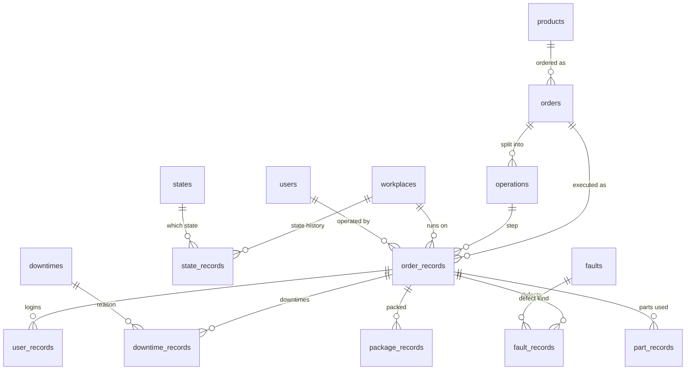
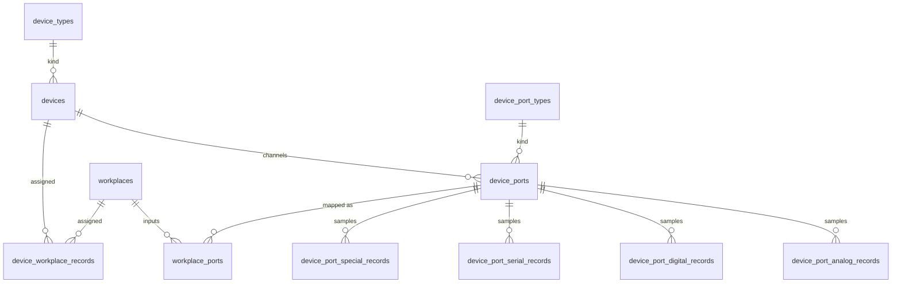
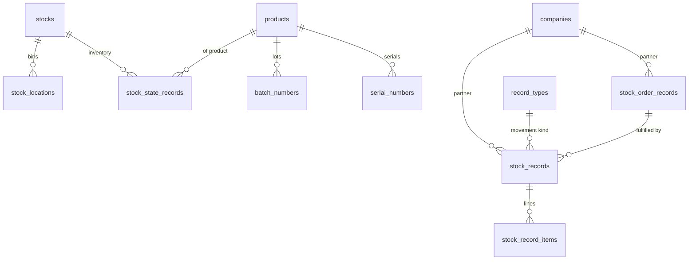

# Database Model

Reference documentation for the `github.com/jahoda-tech/database` schema — the shared GORM model package for a Manufacturing Execution System (MES).

- **Source of truth:** `database.go` (80 struct definitions, one file)
- **Target database:** PostgreSQL (consumers use `gorm.io/driver/postgres`)
- **ORM:** GORM v2; tables are created/updated by consuming services via `AutoMigrate`
- This document is a hand-maintained snapshot. Update it when `database.go` changes.

---

## Table of Contents

1. [Conventions](#conventions)
2. [Domain Overview](#domain-overview)
3. [Workplaces & States](#1-workplaces--states)
4. [Production Catalog](#2-production-catalog)
5. [Production Records](#3-production-records)
6. [Downtime, Breakdown & Fault Catalogs](#4-downtime-breakdown--fault-catalogs)
7. [Packaging & Traceability](#5-packaging--traceability)
8. [Devices & Data Acquisition](#6-devices--data-acquisition)
9. [Users](#7-users)
10. [Alarms](#8-alarms)
11. [Maintenance](#9-maintenance)
12. [Checklists](#10-checklists)
13. [Warehouse / Stock](#11-warehouse--stock)
14. [Business Partners](#12-business-partners)
15. [Aggregations & Telemetry](#13-aggregations--telemetry)
16. [Web & Application Support](#14-web--application-support)
17. [Notes & Caveats](#notes--caveats)

---

## Conventions

### Two struct patterns

**Master / config / most record entities** embed `gorm.Model`, which contributes these columns to every such table (not repeated in the tables below):

| Column | PG type | Meaning |
|---|---|---|
| `id` | `bigserial` | Primary key |
| `created_at` | `timestamptz` | Set by GORM on insert |
| `updated_at` | `timestamptz` | Set by GORM on update |
| `deleted_at` | `timestamptz`, indexed | Soft delete — default GORM queries exclude rows where it is non-NULL |

**High-volume raw time-series tables** (`device_port_analog_records`, `device_port_digital_records`, `device_port_serial_records`, `device_port_special_records`) use a manual `ID int` primary key with no timestamps and no soft delete, to keep rows narrow.

### Go → PostgreSQL type mapping

| Go type | PG type | Notes |
|---|---|---|
| `string` | `text` | |
| `int` | `bigint` | |
| `bool` | `boolean` | |
| `float32`, `float64` | `numeric` | |
| `time.Time` | `timestamptz` | |
| `time.Duration` | `bigint` | Nanoseconds |
| `[]byte` | `bytea` | |
| `datatypes.JSON` | `jsonb` | Explicit `type:jsonb` tag |
| `sql.NullInt64` | `bigint` | NULL-capable in practice |
| `sql.NullFloat64` | `numeric` | NULL-capable in practice |
| `sql.NullString` | `text` | NULL-capable in practice |
| `sql.NullTime` | `timestamptz` | NULL-capable in practice |

No column uses an explicit `not null` tag, so DDL-level nullability is permissive everywhere; *intended* nullability is conveyed by using `sql.Null*` types in Go.

### Recurring fields

| Field | Meaning |
|---|---|
| `note` | Free-text human annotation; present on most tables |
| `data` | Flexible JSONB payload, GIN-indexed for `@>` containment queries |
| `external_id` | Key of the matching row in an external system (ERP), B-tree indexed |
| `barcode` | Scannable identifier used at shop-floor terminals |

Every foreign-key column (`xxx_id`) has a companion struct field of the referenced type (e.g. `WorkplaceID int` + `Workplace Workplace`) used for GORM preloading; those companion fields produce no columns and are omitted from the tables below.

### Index conventions

- Every FK column *should* carry a standalone B-tree index (GORM does not auto-index FKs). See [Notes & Caveats](#notes--caveats) for columns that rely only on composite-unique membership.
- Time-series tables carry a **BRIN** index on the main `date_time` / `date_time_start` column (`idx_<table>_brin`) — kilobytes instead of gigabytes for append-only data.
- "Open record" tables (with `date_time_end sql.NullTime`) carry a **partial index** on `workplace_id WHERE date_time_end IS NULL` (`idx_<table>_open`) for fast current-state lookups.
- Composite unique indexes are declared with `uniqueIndex:name[,priority:N]`; only the leading column is usable for standalone index scans.

### Attribute tokens used below

| Token | Meaning |
|---|---|
| `uniq` | Member of the table's unique index (composite key listed under each table header, in column order) |
| `idx` | Standalone B-tree index |
| `BRIN` | BRIN index |
| `GIN` | GIN index |
| `open-idx` | Partial index `WHERE date_time_end IS NULL` |
| `FK → t` | References table `t` (its `id`) |
| `default: x` | Column default |

### Naming

Table names are GORM defaults: snake_case, pluralized struct name (`Workplace` → `workplaces`, `DevicePortAnalogRecord` → `device_port_analog_records`). One explicit override: `Company` → `companies` via `TableName()`.

---

## Domain Overview

| Domain | Tables |
|---|---|
| Workplaces & states | `workplaces`, `workplace_modes`, `workplace_sections`, `workplace_section_records`, `workplace_ports`, `workplace_workshifts`, `workshifts`, `consumption_types`, `states`, `state_records` |
| Production catalog | `products`, `product_types`, `count_types`, `parts`, `orders`, `operations`, `information_records`, `file_records` |
| Production records | `order_records`, `user_records`, `downtime_records`, `breakdown_records`, `fault_records`, `package_records`, `part_records`, `note_records`, `image_records` |
| Downtime/breakdown/fault catalogs | `downtimes`, `downtime_types`, `breakdowns`, `breakdown_types`, `faults`, `fault_types` |
| Packaging & traceability | `packages`, `package_types`, `product_package_records`, `serial_numbers`, `batch_numbers` |
| Devices & data acquisition | `devices`, `device_types`, `device_workplace_records`, `device_ports`, `device_port_types`, `device_port_{analog,digital,serial,special}_records` |
| Users | `users`, `user_roles`, `user_types` |
| Alarms | `alarms`, `alarm_records` |
| Maintenance | `maintenance_types`, `maintenances`, `places`, `maintenance_workplace_records`, `maintenance_records` |
| Checklists | `checklists`, `checklist_records` |
| Warehouse / stock | `stocks`, `stock_locations`, `stock_state_records`, `record_types`, `stock_order_records`, `stock_records`, `stock_record_items` |
| Business partners | `companies`, `company_types` |
| Aggregations & telemetry | `summary_records`, `shift_summary_records`, `system_records` |
| Web & application support | `settings`, `locales`, `page_counts`, `web_user_records`, `web_user_settings`, `reports`, `bookmarks`, `layouts`, `holidays` |

### Core production flow

### Data acquisition

### Warehouse

---

## 1. Workplaces & States

### `workplaces` — Workplace

A monitored machine / work center — the central entity most records hang off. Carries electrical parameters used for energy-consumption computation.

Embeds `gorm.Model`. Unique: `(name)`.

| Column | Type | Attributes | Description |
|---|---|---|---|
| `name` | string | uniq | Workplace name. |
| `code` | string | | Short workplace code. |
| `workplace_mode_id` | int | idx, FK → workplace_modes | Timing behavior (downtime/poweroff thresholds). |
| `planned_duration` | time.Duration | default: 24h | Planned production time per day (0–24h), the OEE availability denominator. |
| `location` | string | | Physical placement (hall, line, cell). |
| `phases` | int | | Number of electrical phases. |
| `voltage` | int | | Supply voltage. |
| `power_factor` | float32 | | Power factor used in consumption math. |
| `consumption_type_id` | int | idx, FK → consumption_types, default: 1 | Energy-metering category. |
| `consumption_impulses_per_watt` | float32 | | Calibration for impulse energy meters. |
| `unit` | string | | Display unit for produced counts. |
| `note`, `data`, `external_id` | | GIN / idx | Standard recurring fields. |

### `workplace_modes` — WorkplaceMode

Behavior profile deciding when a workplace flips into downtime or poweroff state.

Embeds `gorm.Model`. Unique: `(name)`.

| Column | Type | Attributes | Description |
|---|---|---|---|
| `name` | string | uniq | Mode name. |
| `downtime_duration` | time.Duration | | Idle interval after which state switches to downtime (ns). |
| `poweroff_duration` | time.Duration | | Interval after which state switches to poweroff (ns). |
| `note`, `data`, `external_id` | | GIN / idx | Standard recurring fields. |

### `workplace_sections` — WorkplaceSection

Grouping of workplaces (production hall, line) used for dashboards and checklist scoping.

Embeds `gorm.Model`. Unique: `(name)`.

| Column | Type | Attributes | Description |
|---|---|---|---|
| `name` | string | uniq | Section name. |
| `note`, `data`, `external_id` | | GIN / idx | Standard recurring fields. |

### `workplace_section_records` — WorkplaceSectionRecord

Assignment of a workplace to a section (M:N join with history via soft delete).

Embeds `gorm.Model`. Unique: `(workplace_section_id, workplace_id)`.

| Column | Type | Attributes | Description |
|---|---|---|---|
| `workplace_section_id` | int | uniq, FK → workplace_sections | Section. |
| `workplace_id` | int | uniq, FK → workplaces | Workplace. |
| `note` | string | | Annotation. |

### `workplace_ports` — WorkplacePort

Logical input of a workplace: binds a physical device port to the workplace and defines how its signal is interpreted (state source, OK/NOK counter, analog limits).

Embeds `gorm.Model`. Unique: `(name, device_port_id, workplace_id)`.

| Column | Type | Attributes | Description |
|---|---|---|---|
| `name` | string | uniq | Port label. |
| `device_port_id` | int | uniq, FK → device_ports | Physical device channel behind this input. |
| `state_id` | sql.NullInt64 | idx, FK → states | State this port drives when active (e.g. Production). |
| `workplace_id` | int | uniq, FK → workplaces | Owning workplace. |
| `color` | sql.NullString | | Display color. |
| `counter_ok` | bool | default: false | Port counts good pieces. |
| `counter_nok` | bool | default: false | Port counts bad pieces. |
| `high_value` | float32 | | Upper analog limit. |
| `low_value` | float32 | | Lower analog limit. |
| `note`, `data` | | GIN | Standard recurring fields. |

### `workplace_workshifts` — WorkplaceWorkshift

M:N join assigning shift patterns to workplaces.

Embeds `gorm.Model`. Unique: `(workplace_id, workshift_id)`.

| Column | Type | Attributes | Description |
|---|---|---|---|
| `workplace_id` | int | uniq, FK → workplaces | Workplace. |
| `workshift_id` | int | uniq, FK → workshifts | Shift. |
| `note`, `data` | | GIN | Standard recurring fields. |

### `workshifts` — Workshift

Shift definition (morning, afternoon, night).

Embeds `gorm.Model`. Unique: `(name)`.

| Column | Type | Attributes | Description |
|---|---|---|---|
| `name` | string | uniq | Shift name. |
| `workshift_start` | int | | Shift start as integer time-of-day offset (unit convention owned by consumers). |
| `workshift_end` | int | | Shift end, same convention. |
| `note`, `data`, `external_id` | | GIN / idx | Standard recurring fields. |

### `consumption_types` — ConsumptionType

Catalog of energy-consumption metering categories for workplaces.

Embeds `gorm.Model`. Unique: `(name)`.

| Column | Type | Attributes | Description |
|---|---|---|---|
| `name` | string | uniq | Type name. |
| `code` | string | | Short code. |
| `note`, `data` | | GIN | Standard recurring fields. |

### `states` — State

Catalog of workplace states (typically Production / Downtime / Poweroff).

Embeds `gorm.Model`. Unique: `(name)`.

| Column | Type | Attributes | Description |
|---|---|---|---|
| `name` | string | uniq | State name. |
| `color` | string | | UI color. |
| `type` | string | | Classification code. |
| `note`, `data` | | GIN | Standard recurring fields. |

### `state_records` — StateRecord

Append-only state-change log per workplace. A new row opens a state; the previous state implicitly ends at the next row's start (no `date_time_end`).

Embeds `gorm.Model`. Unique: `(workplace_id, state_id, date_time_start)` — priorities 1, 2, 3.

| Column | Type | Attributes | Description |
|---|---|---|---|
| `date_time_start` | time.Time | uniq(p3), BRIN | When the workplace entered the state. |
| `state_id` | int | uniq(p2), idx, FK → states | State entered. |
| `workplace_id` | int | uniq(p1, leading), FK → workplaces | Workplace (leading unique column serves standalone lookups). |
| `note` | string | | Annotation. |

---

## 2. Production Catalog

### `products` — Product

Manufactured item master data: identification, cycle time, pricing.

Embeds `gorm.Model`. Unique: `(name, barcode)`.

| Column | Type | Attributes | Description |
|---|---|---|---|
| `name` | string | uniq | Product name. |
| `barcode` | string | uniq | Scannable product identifier. |
| `unit` | sql.NullString | | Unit of measure. |
| `downtime_duration` | time.Duration | | Product-specific idle threshold before downtime (ns). |
| `product_type_id` | int | idx, FK → product_types, default: 1 | Product category. |
| `count_type_id` | int | idx, FK → count_types, default: 1 | How counts are interpreted (pieces, meters, …). |
| `cycle_time` | float64 | | Nominal seconds per cycle. |
| `location` | bool | default: false | Location-handling flag (semantics owned by consumers). |
| `purchase_price` | sql.NullFloat64 | | Purchase price. |
| `sale_price` | sql.NullFloat64 | | Sale price. |
| `partner_price` | sql.NullFloat64 | | Partner price. |
| `fee` | sql.NullFloat64 | | Additional fee. |
| `image` | []byte | | Embedded product image. |
| `image_url` | string | | External image URL. |
| `information` | string | | Free text shown to operators. |
| `note`, `data`, `external_id` | | GIN / idx | Standard recurring fields. |

### `product_types` — ProductType

Product category catalog.

Embeds `gorm.Model`. Unique: `(name)`.

| Column | Type | Attributes | Description |
|---|---|---|---|
| `name` | string | uniq | Type name. |
| `type` | string | | Classification code. |
| `note`, `data`, `external_id` | | GIN / idx | Standard recurring fields. |

### `count_types` — CountType

Catalog for how production counts are measured/interpreted.

Embeds `gorm.Model`. Unique: `(name)`.

| Column | Type | Attributes | Description |
|---|---|---|---|
| `name` | string | uniq | Count type name. |
| `type` | string | | Classification code. |
| `note`, `data` | | GIN | Standard recurring fields. |

### `parts` — Part

Component / material part catalog (consumed during production, see `part_records`).

Embeds `gorm.Model`. Unique: `(name)`.

| Column | Type | Attributes | Description |
|---|---|---|---|
| `name` | string | uniq | Part name. |
| `barcode` | string | | Scannable identifier. |
| `note`, `data`, `external_id` | | GIN / idx | Standard recurring fields. |

### `orders` — Order

Production order: what to make, how many, optionally where.

Embeds `gorm.Model`. Unique: `(name, barcode)`.

| Column | Type | Attributes | Description |
|---|---|---|---|
| `name` | string | uniq | Order name/number. |
| `product_id` | sql.NullInt64 | idx, FK → products | Product to produce. |
| `workplace_id` | sql.NullInt64 | idx, FK → workplaces | Preferred/assigned workplace. |
| `barcode` | string | uniq | Scannable order identifier. |
| `date_time_request` | sql.NullTime | | Requested/due date. |
| `cavity` | int | | Pieces per machine cycle (mold cavities). |
| `count_request` | int | | Ordered quantity. |
| `information` | string | | Free text shown to operators. |
| `note`, `data`, `external_id` | | GIN / idx | Standard recurring fields. |

### `operations` — Operation

A step of a production order.

Embeds `gorm.Model`. Unique: `(name, barcode)`.

| Column | Type | Attributes | Description |
|---|---|---|---|
| `name` | string | uniq | Operation name/number. |
| `order_id` | int | idx, FK → orders | Parent order. |
| `product_id` | sql.NullInt64 | idx, FK → products | Product at this step, if different from order product. |
| `barcode` | string | uniq | Scannable operation identifier. |
| `date_time_request` | sql.NullTime | | Requested/due date. |
| `information` | string | | Free text shown to operators. |
| `note`, `data`, `external_id` | | GIN / idx | Standard recurring fields. |

### `information_records` — InformationRecord

Free-text information attached to an order and/or operation.

Embeds `gorm.Model`. Unique: `(information, order_id, operation_id)`.

| Column | Type | Attributes | Description |
|---|---|---|---|
| `information` | string | uniq | The information text itself. |
| `order_id` | sql.NullInt64 | uniq, idx, FK → orders | Scoped order. |
| `operation_id` | sql.NullInt64 | uniq, idx, FK → operations | Scoped operation. |
| `note`, `data` | | GIN | Standard recurring fields. |

### `file_records` — FileRecord

File/URL attachment scoped to a product, order and/or operation (e.g. drawings, work instructions).

Embeds `gorm.Model`. Unique: `(product_id, order_id, operation_id, name)` — priorities 1–4.

| Column | Type | Attributes | Description |
|---|---|---|---|
| `name` | string | uniq(p4) | File name, unique within its scope. |
| `product_id` | sql.NullInt64 | uniq(p1, leading), FK → products | Scoped product. |
| `order_id` | sql.NullInt64 | uniq(p2), FK → orders | Scoped order. |
| `operation_id` | sql.NullInt64 | uniq(p3), FK → operations | Scoped operation. |
| `url` | string | | File location. |
| `note` | string | | Annotation. |

---

## 3. Production Records

### `order_records` — OrderRecord

A production run: an order+operation executed on a workplace over an interval. The central fact table — most other production records link to it.

Embeds `gorm.Model`. Unique: `(date_time_start, order_id, operation_id, workplace_id, user_id)`.

| Column | Type | Attributes | Description |
|---|---|---|---|
| `date_time_start` | time.Time | uniq, BRIN, composite idx `idx_order_datetime_workplace` | Run start. |
| `date_time_end` | sql.NullTime | idx `idx_order_datetime_end` | Run end; NULL while running. |
| `order_id` | int | uniq, idx, FK → orders | Executed order. |
| `operation_id` | int | uniq, idx, FK → operations | Executed operation. |
| `workplace_id` | int | uniq, idx `idx_order_workplace`, composite idx `idx_order_datetime_workplace`, open-idx, FK → workplaces | Workplace of the run. |
| `user_id` | sql.NullInt64 | uniq, idx, FK → users | Operator who started the run. |
| `product_id` | sql.NullInt64 | idx, FK → products | Product being produced. |
| `workplace_mode_id` | int | idx, FK → workplace_modes | Mode captured at run time. |
| `workshift_id` | int | idx, FK → workshifts | Shift the run belongs to. |
| `average_cycle` | float32 | | Average cycle time achieved. |
| `cavity` | int | | Pieces per cycle used for count math. |
| `count_ok` | int | | Good pieces produced. |
| `count_nok` | int | | Bad pieces produced. |
| `consumption` | float32 | | Energy consumed during the run. |
| `production_duration` | time.Duration | | Accumulated production time (ns). |
| `downtime_duration` | time.Duration | | Accumulated downtime within the run (ns). |
| `transfer_state` | string | | Sync status toward an external system (ERP). |
| `note`, `data` | | GIN | Standard recurring fields. |

### `user_records` — UserRecord

Operator presence interval on a production run (login/logout at the terminal).

Embeds `gorm.Model`. Unique: `(date_time_start, order_record_id, workplace_id, user_id)`.

| Column | Type | Attributes | Description |
|---|---|---|---|
| `date_time_start` | time.Time | uniq, BRIN | Login time. |
| `date_time_end` | sql.NullTime | idx | Logout time; NULL while logged in. |
| `order_record_id` | int | uniq, idx, FK → order_records | Run the user worked on. |
| `workplace_id` | int | uniq, idx, open-idx, FK → workplaces | Workplace. |
| `user_id` | int | uniq, idx, FK → users | Operator. |
| `order_id` | sql.NullInt64 | idx, FK → orders | Denormalized order reference. |
| `operation_id` | sql.NullInt64 | idx, FK → operations | Denormalized operation reference. |
| `product_id` | sql.NullInt64 | idx, FK → products | Denormalized product reference. |
| `note` | string | | Annotation. |

### `downtime_records` — DowntimeRecord

Downtime interval on a workplace with its reason; optionally tied to the running order record and operator.

Embeds `gorm.Model`. Unique: `(date_time_start, workplace_id, downtime_id, order_record_id, user_id)`.

| Column | Type | Attributes | Description |
|---|---|---|---|
| `date_time_start` | time.Time | uniq, BRIN | Downtime start. |
| `date_time_end` | sql.NullTime | idx | Downtime end; NULL while ongoing. |
| `workplace_id` | int | uniq, idx, open-idx, FK → workplaces | Workplace. |
| `downtime_id` | int | uniq, idx, FK → downtimes | Downtime reason. |
| `order_record_id` | sql.NullInt64 | uniq, idx, FK → order_records | Run during which downtime happened. |
| `user_id` | sql.NullInt64 | uniq, idx, FK → users | Operator who reported it. |
| `order_id` | sql.NullInt64 | idx, FK → orders | Denormalized order reference. |
| `operation_id` | sql.NullInt64 | idx, FK → operations | Denormalized operation reference. |
| `product_id` | sql.NullInt64 | idx, FK → products | Denormalized product reference. |
| `consumption` | float32 | | Energy consumed during downtime. |
| `transfer_state` | string | | Sync status toward an external system (ERP). |
| `note`, `data` | | GIN | Standard recurring fields. |

### `breakdown_records` — BreakdownRecord

Machine breakdown interval on a workplace.

Embeds `gorm.Model`. Unique: `(date_time_start, breakdown_id, workplace_id, user_id)`.

| Column | Type | Attributes | Description |
|---|---|---|---|
| `date_time_start` | time.Time | uniq, BRIN | Breakdown start. |
| `date_time_end` | sql.NullTime | idx | Breakdown end; NULL while ongoing. |
| `breakdown_id` | int | uniq, idx, FK → breakdowns | Breakdown kind. |
| `workplace_id` | int | uniq, idx, open-idx, FK → workplaces | Workplace. |
| `user_id` | int | uniq, idx, FK → users | Reporting user. |
| `note` | string | | Annotation. |

### `fault_records` — FaultRecord

Point-in-time quality fault event: a defect kind with a piece count, tied to workplace/user and optionally to the run.

Embeds `gorm.Model`. Unique: `(date_time, fault_id, workplace_id, user_id)`.

| Column | Type | Attributes | Description |
|---|---|---|---|
| `date_time` | time.Time | uniq, BRIN | When the fault was recorded. |
| `order_record_id` | sql.NullInt64 | idx, FK → order_records | Run the fault belongs to. |
| `fault_id` | int | uniq, idx, FK → faults | Defect kind. |
| `workplace_id` | int | uniq, idx, FK → workplaces | Workplace. |
| `user_id` | int | uniq, idx, FK → users | Reporting user. |
| `order_id` | sql.NullInt64 | idx, FK → orders | Denormalized order reference. |
| `operation_id` | sql.NullInt64 | idx, FK → operations | Denormalized operation reference. |
| `product_id` | sql.NullInt64 | idx, FK → products | Denormalized product reference. |
| `count` | int | | Number of faulty pieces. |
| `note` | string | | Annotation. |

### `package_records` — PackageRecord

Packaging event: a package of given definition completed with a piece count.

Embeds `gorm.Model`. Unique: `(date_time, package_id, workplace_id, user_id)`.

| Column | Type | Attributes | Description |
|---|---|---|---|
| `date_time` | time.Time | uniq, BRIN | When packed. |
| `order_record_id` | int | idx, FK → order_records | Run the package came from. |
| `package_id` | int | uniq, idx, FK → packages | Package definition. |
| `workplace_id` | int | uniq, idx, FK → workplaces | Workplace. |
| `user_id` | int | uniq, idx, FK → users | Packing user. |
| `count` | int | | Pieces in the package. |
| `note` | string | | Annotation. |

### `part_records` — PartRecord

Part/material consumption event during a run.

Embeds `gorm.Model`. Unique: `(date_time, part_id, workplace_id, user_id)`.

| Column | Type | Attributes | Description |
|---|---|---|---|
| `date_time` | time.Time | uniq, BRIN | When consumed/recorded. |
| `order_record_id` | int | idx, FK → order_records | Run the parts were used in. |
| `part_id` | int | uniq, idx, FK → parts | Part consumed. |
| `workplace_id` | int | uniq, idx, FK → workplaces | Workplace. |
| `user_id` | int | uniq, idx, FK → users | Recording user. |
| `count` | int | | Quantity consumed. |
| `note` | string | | Annotation. |

### `note_records` — NoteRecord

Timestamped operator note, optionally scoped to run/order/operation/workplace/user/product. Interval-capable (`date_time_end`).

Embeds `gorm.Model`. Unique: `(date_time_start, note_text)`.

| Column | Type | Attributes | Description |
|---|---|---|---|
| `date_time_start` | time.Time | uniq, BRIN | Note start/creation time. |
| `date_time_end` | sql.NullTime | idx | Optional end of validity. |
| `order_record_id` | sql.NullInt64 | idx, FK → order_records | Scoped run. |
| `order_id` | sql.NullInt64 | idx, FK → orders | Scoped order. |
| `operation_id` | sql.NullInt64 | idx, FK → operations | Scoped operation. |
| `workplace_id` | sql.NullInt64 | idx, open-idx, FK → workplaces | Scoped workplace. |
| `user_id` | sql.NullInt64 | idx, FK → users | Author. |
| `product_id` | sql.NullInt64 | idx, FK → products | Scoped product. |
| `note_text` | string | uniq | The note content. |
| `note`, `data` | | GIN | Standard recurring fields. |

### `image_records` — ImageRecord

Image snapshot attached to a production run.

Embeds `gorm.Model`. Unique: `(date_time_start, order_record_id)`.

| Column | Type | Attributes | Description |
|---|---|---|---|
| `date_time_start` | time.Time | uniq, BRIN | Capture time. |
| `order_record_id` | sql.NullInt64 | uniq, idx, FK → order_records | Run the image belongs to. |
| `image` | []byte | | Image bytes. |
| `note` | string | | Annotation. |

---

## 4. Downtime, Breakdown & Fault Catalogs

### `downtimes` — Downtime

Downtime reason catalog (planned maintenance, material shortage, break, …).

Embeds `gorm.Model`. Unique: `(name)`.

| Column | Type | Attributes | Description |
|---|---|---|---|
| `name` | string | uniq | Reason name. |
| `downtime_type_id` | int | idx, FK → downtime_types | Reason category. |
| `barcode` | string | | Scannable code for terminal selection. |
| `color` | string | | UI color. |
| `note`, `data`, `external_id` | | GIN / idx | Standard recurring fields. |

### `downtime_types` — DowntimeType

Downtime reason categories.

Embeds `gorm.Model`. Unique: `(name)`.

| Column | Type | Attributes | Description |
|---|---|---|---|
| `name` | string | uniq | Category name. |
| `note`, `data`, `external_id` | | GIN / idx | Standard recurring fields. |

### `breakdowns` — Breakdown

Breakdown kind catalog.

Embeds `gorm.Model`. Unique: `(name)`.

| Column | Type | Attributes | Description |
|---|---|---|---|
| `name` | string | uniq | Breakdown name. |
| `breakdown_type_id` | int | idx, FK → breakdown_types | Breakdown category. |
| `barcode` | string | | Scannable code. |
| `color` | string | | UI color. |
| `note`, `data`, `external_id` | | GIN / idx | Standard recurring fields. |

### `breakdown_types` — BreakdownType

Breakdown categories.

Embeds `gorm.Model`. Unique: `(name)`.

| Column | Type | Attributes | Description |
|---|---|---|---|
| `name` | string | uniq | Category name. |
| `note`, `data`, `external_id` | | GIN / idx | Standard recurring fields. |

### `faults` — Fault

Quality defect catalog.

Embeds `gorm.Model`. Unique: `(name)`.

| Column | Type | Attributes | Description |
|---|---|---|---|
| `name` | string | uniq | Defect name. |
| `fault_type_id` | int | idx, FK → fault_types | Defect category. |
| `barcode` | string | | Scannable code. |
| `note`, `data`, `external_id` | | GIN / idx | Standard recurring fields. |

### `fault_types` — FaultType

Defect categories.

Embeds `gorm.Model`. Unique: `(name)`.

| Column | Type | Attributes | Description |
|---|---|---|---|
| `name` | string | uniq | Category name. |
| `note`, `data`, `external_id` | | GIN / idx | Standard recurring fields. |

---

## 5. Packaging & Traceability

### `packages` — Package

Package definition for a product (what a "box" of the product is).

Embeds `gorm.Model`. Unique: `(name, product_id)`.

| Column | Type | Attributes | Description |
|---|---|---|---|
| `name` | string | uniq | Package name. |
| `product_id` | int | uniq, FK → products | Packaged product. |
| `package_type_id` | int | idx, FK → package_types | Package kind (carries default count). |
| `barcode` | string | | Scannable code. |
| `note`, `data`, `external_id` | | GIN / idx | Standard recurring fields. |

### `package_types` — PackageType

Package kind catalog; `count` is the nominal pieces-per-package.

Embeds `gorm.Model`. Unique: `(name)`.

| Column | Type | Attributes | Description |
|---|---|---|---|
| `name` | string | uniq | Kind name. |
| `count` | int | | Nominal pieces per package. |
| `note`, `data`, `external_id` | | GIN / idx | Standard recurring fields. |

### `product_package_records` — ProductPackageRecord

Physical package instance identified by its barcode, mapped to serial/batch numbers for traceability.

Embeds `gorm.Model`. Unique: `(package_barcode)`.

| Column | Type | Attributes | Description |
|---|---|---|---|
| `package_barcode` | string | uniq | Barcode of the physical package. |
| `serial_number_id` | sql.NullInt64 | idx, FK → serial_numbers | Serial number inside the package. |
| `batch_number_id` | sql.NullInt64 | idx, FK → batch_numbers | Batch/lot inside the package. |
| `note` | string | | Annotation. |

### `serial_numbers` — SerialNumber

Serial number of a single produced piece of a product.

Embeds `gorm.Model`. Unique: `(product_id, number)`.

| Column | Type | Attributes | Description |
|---|---|---|---|
| `product_id` | int | uniq (leading), FK → products | Product. |
| `number` | string | uniq | Serial number value. |
| `note`, `data`, `external_id` | | GIN / idx | Standard recurring fields. |

### `batch_numbers` — BatchNumber

Batch/lot of a product with expiration information.

Embeds `gorm.Model`. Unique: `(product_id, number)`.

| Column | Type | Attributes | Description |
|---|---|---|---|
| `product_id` | int | uniq (leading), FK → products | Product. |
| `number` | string | uniq | Batch/lot number. |
| `expiration_duration` | time.Duration | | Shelf life (ns). |
| `note`, `data`, `external_id` | | GIN / idx | Standard recurring fields. |

---

## 6. Devices & Data Acquisition

### `devices` — Device

Physical data-collection unit (shop-floor terminal, PLC gateway) polled by acquisition services.

Embeds `gorm.Model`. Unique: `(name, device_type_id, ip_address)`.

| Column | Type | Attributes | Description |
|---|---|---|---|
| `name` | string | uniq | Device name. |
| `device_type_id` | int | uniq, FK → device_types | Device kind. |
| `activated` | bool | default: false | Whether the device is polled. |
| `ip_address` | string | uniq | Network address. |
| `mac_address` | string | | Hardware address. |
| `settings` | string | | Free-form device configuration. |
| `type_name` | string | | Device model string. |
| `note`, `data`, `external_id` | | GIN / idx | Standard recurring fields. |

### `device_types` — DeviceType

Device kind catalog.

Embeds `gorm.Model`. Unique: `(name)`.

| Column | Type | Attributes | Description |
|---|---|---|---|
| `name` | string | uniq | Kind name. |
| `note`, `data` | | GIN | Standard recurring fields. |

### `device_workplace_records` — DeviceWorkplaceRecord

Assignment of a device to a workplace (M:N join).

Embeds `gorm.Model`. Unique: `(device_id, workplace_id)`.

| Column | Type | Attributes | Description |
|---|---|---|---|
| `device_id` | int | uniq, FK → devices | Device. |
| `workplace_id` | int | uniq, FK → workplaces | Workplace. |
| `note` | string | | Annotation. |

### `device_ports` — DevicePort

A channel on a device: physical input, PLC address, or virtual (computed) port.

Embeds `gorm.Model`. Unique: `(name, device_id)`.

| Column | Type | Attributes | Description |
|---|---|---|---|
| `name` | string | uniq | Port name. |
| `device_id` | int | uniq, FK → devices | Owning device. |
| `device_port_type_id` | int | idx, FK → device_port_types | Port kind (analog/digital/serial/special). |
| `port_number` | int | | Channel number on the device. |
| `plc_data_type` | string | | PLC data type to read. |
| `plc_data_address` | string | | PLC register address. |
| `settings` | string | | Free-form port configuration. |
| `unit` | string | | Unit of the measured value. |
| `virtual` | bool | default: false | Computed port, not a physical input. |
| `threshold` | float64 | default: -999999 | Recording/evaluation threshold; `-999999` is the "unset" sentinel. |
| `note`, `data` | | GIN | Standard recurring fields. |

### `device_port_types` — DevicePortType

Port kind catalog (analog, digital, serial, special).

Embeds `gorm.Model`. Unique: `(name)`.

| Column | Type | Attributes | Description |
|---|---|---|---|
| `name` | string | uniq | Kind name. |
| `note`, `data` | | GIN | Standard recurring fields. |

### Raw sample tables

The four highest-volume tables. Manual `id` primary key, **no** `gorm.Model` (no timestamps, no soft delete) — rows stay narrow. All share: unique `(device_port_id, date_time)` (priorities 1, 2) and a BRIN index on `date_time`.

#### `device_port_analog_records` — DevicePortAnalogRecord

| Column | Type | Attributes | Description |
|---|---|---|---|
| `id` | int | PK | Manual primary key. |
| `date_time` | time.Time | uniq(p2), BRIN | Sample timestamp. |
| `device_port_id` | int | uniq(p1, leading), FK → device_ports | Sampled port. |
| `data` | float32 | | Analog value. |

#### `device_port_digital_records` — DevicePortDigitalRecord

| Column | Type | Attributes | Description |
|---|---|---|---|
| `id` | int | PK | Manual primary key. |
| `date_time` | time.Time | uniq(p2), BRIN | Sample timestamp. |
| `device_port_id` | int | uniq(p1, leading), FK → device_ports | Sampled port. |
| `data` | int | | Digital value (0/1 edge states). |

Extra partial B-tree index `idx_digital_record_zero` on `(device_port_id, date_time) WHERE data = 0`, created `CONCURRENTLY`, so counter counts over `data = 0` run as index-only scans.

#### `device_port_serial_records` — DevicePortSerialRecord

| Column | Type | Attributes | Description |
|---|---|---|---|
| `id` | int | PK | Manual primary key. |
| `date_time` | time.Time | uniq(p2), BRIN | Sample timestamp. |
| `device_port_id` | int | uniq(p1, leading), FK → device_ports | Sampled port. |
| `data` | float32 | | Value reported by serial-line device. |

#### `device_port_special_records` — DevicePortSpecialRecord

| Column | Type | Attributes | Description |
|---|---|---|---|
| `id` | int | PK | Manual primary key. |
| `date_time` | time.Time | uniq(p2), BRIN | Sample timestamp. |
| `device_port_id` | int | uniq(p1, leading), FK → device_ports | Sampled port. |
| `data` | string | | Free-form/special payload. |

---

## 7. Users

### `users` — User

Operator or application user. Terminal identification via barcode/PIN/RFID; web login via email/password.

Embeds `gorm.Model`. Unique: `(first_name, second_name, email)`.

| Column | Type | Attributes | Description |
|---|---|---|---|
| `first_name` | string | uniq | First name. |
| `second_name` | string | uniq | Family name. |
| `user_role_id` | int | idx, FK → user_roles | Permission role. |
| `user_type_id` | int | idx, FK → user_types | User category. |
| `barcode` | string | idx | Terminal login barcode. |
| `email` | string | uniq | Web login / notifications. |
| `password` | string | | Password (hash). |
| `phone` | string | | Phone number. |
| `pin` | string | idx | Terminal login PIN. |
| `position` | string | | Job position. |
| `rfid` | string | idx | Terminal login RFID tag. |
| `locale` | string | | Preferred UI language. |
| `note`, `data`, `external_id` | | GIN / idx | Standard recurring fields. |

### `user_roles` — UserRole

Permission role catalog.

Embeds `gorm.Model`. Unique: `(name)`.

| Column | Type | Attributes | Description |
|---|---|---|---|
| `name` | string | uniq | Role name. |
| `note`, `data`, `external_id` | | GIN / idx | Standard recurring fields. |

### `user_types` — UserType

User category catalog (also used for checklist targeting).

Embeds `gorm.Model`. Unique: `(name)`.

| Column | Type | Attributes | Description |
|---|---|---|---|
| `name` | string | uniq | Category name. |
| `note`, `data`, `external_id` | | GIN / idx | Standard recurring fields. |

---

## 8. Alarms

### `alarms` — Alarm

Alarm definition: a SQL condition evaluated by the alarm service; on trigger, a notification is composed from the message fields and sent to recipients.

Embeds `gorm.Model`. Unique: `(name, workplace_id)`.

| Column | Type | Attributes | Description |
|---|---|---|---|
| `name` | string | uniq | Alarm name. |
| `workplace_id` | sql.NullInt64 | uniq, idx, FK → workplaces | Optional workplace scope; NULL = not workplace-bound. |
| `sql_command` | string | | Condition query evaluated periodically. |
| `message_header` | string | | Notification subject template. |
| `message_text` | string | | Notification body template. |
| `recipients` | string | | Notification recipients (e.g. e-mail list). |
| `url` | string | | Link included in the notification. |
| `pdf` | string | | PDF attachment reference. |
| `note`, `data`, `external_id` | | GIN / idx | Standard recurring fields. |

### `alarm_records` — AlarmRecord

Alarm firing instance: opens when the condition triggers, closes when resolved; `date_time_processed` marks notification handling.

Embeds `gorm.Model`. Unique: `(date_time_start, alarm_id)`.

| Column | Type | Attributes | Description |
|---|---|---|---|
| `date_time_start` | time.Time | uniq, BRIN | When the alarm fired. |
| `date_time_end` | sql.NullTime | idx | When it was resolved; NULL while active. |
| `date_time_processed` | sql.NullTime | idx | When the notification was processed/sent. |
| `alarm_id` | int | uniq, idx, FK → alarms | Alarm definition. |
| `workplace_id` | sql.NullInt64 | idx, open-idx, FK → workplaces | Workplace concerned. |
| `user_id` | sql.NullInt64 | idx, FK → users | User who handled the alarm. |
| `note` | string | | Annotation. |

---

## 9. Maintenance

### `maintenance_types` — MaintenanceType

Scheduling rule for maintenance: either calendar-based (day of week/month) or usage-based (accumulated total / power-on time since the last record). Unused trigger fields stay NULL.

Embeds `gorm.Model`. Unique: `(name)`.

| Column | Type | Attributes | Description |
|---|---|---|---|
| `name` | string | uniq | Rule name. |
| `day_of_week` | sql.NullInt64 | | Trigger: fixed weekday. |
| `day_of_month` | sql.NullInt64 | | Trigger: fixed day of month. |
| `total_time_from_last_record` | sql.NullInt64 | | Trigger: elapsed total time since last maintenance. |
| `power_on_time_from_last_record` | sql.NullInt64 | | Trigger: accumulated power-on time since last maintenance. |
| `note`, `data`, `external_id` | | GIN / idx | Standard recurring fields. |

### `maintenances` — Maintenance

Maintenance task definition (what to do, target measurement).

Embeds `gorm.Model`. Unique: `(name)`.

| Column | Type | Attributes | Description |
|---|---|---|---|
| `name` | string | uniq | Task name. |
| `information` | string | | Work instructions. |
| `maintenance_type_id` | int | FK → maintenance_types (**no index**) | Scheduling rule. |
| `image` | []byte | | Embedded instruction image. |
| `image_url` | string | | External image URL. |
| `requested_value` | sql.NullFloat64 | | Target measurement value. |
| `requested_unit` | string | | Unit of the target value. |
| `note`, `data`, `external_id` | | GIN / idx | Standard recurring fields. |

### `places` — Place

Maintenance location for assets that are not workplaces (building, compressor room, …).

Embeds `gorm.Model`. Unique: `(name)`.

| Column | Type | Attributes | Description |
|---|---|---|---|
| `name` | string | uniq | Place name. |
| `information` | string | | Description. |
| `note`, `data`, `external_id` | | GIN / idx | Standard recurring fields. |

### `maintenance_workplace_records` — MaintenanceWorkplaceRecord

Maintenance plan: binds a task to a workplace or place (and optionally a responsible user) with a validity window and repeat interval.

Embeds `gorm.Model`. Unique: `(maintenance_id, workplace_id, user_id, place_id)`.

| Column | Type | Attributes | Description |
|---|---|---|---|
| `maintenance_id` | int | uniq (leading), FK → maintenances | Task. |
| `workplace_id` | sql.NullInt64 | uniq, FK → workplaces | Target workplace (or NULL when place-based). |
| `user_id` | sql.NullInt64 | uniq, FK → users | Responsible user. |
| `place_id` | sql.NullInt64 | uniq, FK → places | Target place (or NULL when workplace-based). |
| `additional_information` | string | | Extra plan info. |
| `start_date` | sql.NullTime | | Plan validity start. |
| `end_date` | sql.NullTime | | Plan validity end. |
| `interval_days` | int | | Repeat interval in days. |
| `note` | string | | Annotation. |

### `maintenance_records` — MaintenanceRecord

Maintenance execution instance: requested, performed, then optionally checked (control) — with status, cost and measured value.

Embeds `gorm.Model`. Unique: `(maintenance_id, requested_date_time, user_id, workplace_id, place_id)`.

| Column | Type | Attributes | Description |
|---|---|---|---|
| `maintenance_id` | int | uniq, idx, FK → maintenances | Task performed. |
| `requested_date_time` | time.Time | uniq, BRIN | When the maintenance was requested/scheduled. |
| `requested_user_id` | sql.NullInt64 | idx, FK → users | Who requested it. |
| `date_time_start` | sql.NullTime | idx | Execution start. |
| `date_time_end` | sql.NullTime | idx | Execution end. |
| `alarm_record_id` | sql.NullInt64 | idx, FK → alarm_records | Alarm that triggered this maintenance, if any. |
| `user_id` | sql.NullInt64 | uniq, idx, FK → users | Performing user. |
| `workplace_id` | sql.NullInt64 | uniq, idx, FK → workplaces | Target workplace. |
| `place_id` | sql.NullInt64 | uniq, idx, FK → places | Target place. |
| `maintenance_note` | string | | Performer's report. |
| `status` | string | | Workflow status. |
| `cost` | float32 | | Maintenance cost. |
| `control_user_id` | sql.NullInt64 | idx, FK → users | User who checked/approved the work. |
| `control_date_time` | sql.NullTime | | When it was checked. |
| `image` | []byte | | Embedded photo of the result. |
| `image_url` | string | | External photo URL. |
| `measured_value` | sql.NullFloat64 | | Measured value against `maintenances.requested_value`. |
| `note` | string | | Annotation. |

---

## 10. Checklists

### `checklists` — Checklist

Checklist item definition: a question/check with a result kind, answer options and scheduling, scoped to workplace/section/user type/product/order/operation.

Embeds `gorm.Model`. Unique: `(name)`.

| Column | Type | Attributes | Description |
|---|---|---|---|
| `name` | string | uniq | Checklist name. |
| `type` | string | | Result kind (number, text, option, datetime). |
| `possibilities` | string | | Answer options for option-type checks. |
| `text` | string | | The question/instruction shown to the user. |
| `start` | string | | Scheduling anchor (when the check becomes due). |
| `start_interval` | int | | Interval from the anchor. |
| `repeat` | sql.NullInt64 | | Repeat interval; NULL = one-shot. |
| `workplace_id` | sql.NullInt64 | idx, FK → workplaces | Scope: workplace. |
| `image` | []byte | | Embedded illustration. |
| `image_url` | string | | External image URL. |
| `workplace_section_id` | sql.NullInt64 | idx, FK → workplace_sections | Scope: section. |
| `user_type_id` | sql.NullInt64 | idx, FK → user_types | Scope: user category that must answer. |
| `product_id` | sql.NullInt64 | idx, FK → products | Scope: product. |
| `order_id` | sql.NullInt64 | idx, FK → orders | Scope: order. |
| `operation_id` | sql.NullInt64 | idx, FK → operations | Scope: operation. |
| `note`, `data` | | GIN | Standard recurring fields. |

### `checklist_records` — ChecklistRecord

A filled-in checklist answer at a point in time; exactly one of the `result_*` columns is meaningful per `checklists.type`.

Embeds `gorm.Model`. Unique: `(date_time, checklist_id, workplace_id, user_id)`.

| Column | Type | Attributes | Description |
|---|---|---|---|
| `date_time` | time.Time | uniq, BRIN | When answered. |
| `checklist_id` | int | uniq, idx, FK → checklists | Checklist answered. |
| `workplace_id` | int | uniq, idx, FK → workplaces | Workplace. |
| `user_id` | int | uniq, idx, FK → users | Answering user. |
| `order_id` | sql.NullInt64 | idx, FK → orders | Context order. |
| `operation_id` | sql.NullInt64 | idx, FK → operations | Context operation. |
| `product_id` | int | idx, FK → products | Context product. |
| `result_number` | sql.NullFloat64 | | Numeric answer. |
| `result_text` | sql.NullString | | Text answer. |
| `result_option` | sql.NullString | | Selected option. |
| `result_date_time` | sql.NullTime | | Datetime answer. |
| `note` | string | | Annotation. |

---

## 11. Warehouse / Stock

### `stocks` — Stock

Warehouse.

Embeds `gorm.Model`. Unique: `(name, code)`.

| Column | Type | Attributes | Description |
|---|---|---|---|
| `name` | string | uniq | Warehouse name. |
| `code` | string | uniq | Warehouse code. |
| `note`, `data`, `external_id` | | GIN / idx | Standard recurring fields. |

### `stock_locations` — StockLocation

Bin/position inside a warehouse with optional capacity limits.

Embeds `gorm.Model`. Unique: `(name, stock_id)`.

| Column | Type | Attributes | Description |
|---|---|---|---|
| `name` | string | uniq | Location name/code. |
| `stock_id` | int | uniq, FK → stocks | Owning warehouse. |
| `max_count` | sql.NullInt64 | | Capacity in pieces. |
| `max_volume` | sql.NullFloat64 | | Capacity in volume. |
| `note`, `data`, `external_id` | | GIN / idx | Standard recurring fields. |

### `stock_state_records` — StockStateRecord

Current inventory quantity per (warehouse, product, serial, batch, location) combination.

Embeds `gorm.Model`. Unique: `(stock_id, product_id, serial_number_id, batch_number_id, stock_location_id)`.

| Column | Type | Attributes | Description |
|---|---|---|---|
| `stock_id` | int | uniq (leading), FK → stocks | Warehouse. |
| `product_id` | int | uniq, FK → products | Product. |
| `serial_number_id` | sql.NullInt64 | uniq, FK → serial_numbers | Serial-tracked piece, if applicable. |
| `batch_number_id` | sql.NullInt64 | uniq, FK → batch_numbers | Batch/lot, if applicable. |
| `stock_location_id` | sql.NullInt64 | uniq, FK → stock_locations | Bin, if location-tracked. |
| `count` | sql.NullInt64 | | Quantity in pieces. |
| `volume` | sql.NullFloat64 | | Quantity in volume. |
| `note` | string | | Annotation. |

### `record_types` — RecordType

Stock movement kind catalog (receipt, issue, transfer).

Embeds `gorm.Model`. Unique: `(name)`.

| Column | Type | Attributes | Description |
|---|---|---|---|
| `name` | string | uniq | Movement kind name. |
| `type` | string | | Classification code. |
| `note`, `data` | | GIN | Standard recurring fields. |

### `stock_order_records` — StockOrderRecord

Stock order: an expected receipt/issue for a product with a business partner, later fulfilled by stock movements.

Embeds `gorm.Model`. Unique: `(date_time_start, stock_id, company_id, record_type_id)`.

| Column | Type | Attributes | Description |
|---|---|---|---|
| `date_time_start` | time.Time | uniq, BRIN | Order creation/start. |
| `stock_id` | int | uniq, idx, FK → stocks | Warehouse concerned. |
| `company_id` | int | uniq, idx, FK → companies | Business partner. |
| `record_type_id` | int | uniq, idx, FK → record_types | Movement kind expected. |
| `product_id` | int | idx, FK → products | Product ordered. |
| `date_time_end` | sql.NullTime | idx | Completion time; NULL while open. |
| `stock_location_id` | sql.NullInt64 | idx, FK → stock_locations | Target/source bin. |
| `serial_number_id` | sql.NullInt64 | idx, FK → serial_numbers | Serial, if tracked. |
| `batch_number_id` | sql.NullInt64 | idx, FK → batch_numbers | Batch, if tracked. |
| `count` | sql.NullInt64 | | Ordered quantity (pieces). |
| `volume` | sql.NullFloat64 | | Ordered quantity (volume). |
| `can_change` | bool | default: false | Order still editable. |
| `completed` | bool | default: false | Order fulfilled. |
| `note`, `data`, `external_id` | | GIN / idx | Standard recurring fields. |

### `stock_records` — StockRecord

Stock movement document header: who moved what kind, between which warehouses, for which partner.

Embeds `gorm.Model`. Unique: `(date_time, user_id, record_type_id, company_id)`.

| Column | Type | Attributes | Description |
|---|---|---|---|
| `date_time` | time.Time | uniq, BRIN | Movement time. |
| `user_id` | int | uniq, idx, FK → users | User performing the movement. |
| `record_type_id` | int | uniq, idx, FK → record_types | Movement kind. |
| `company_id` | int | uniq, idx, FK → companies | Business partner. |
| `stock_in_id` | sql.NullInt64 | idx, FK → stocks | Destination warehouse (receipts/transfers). |
| `stock_out_id` | sql.NullInt64 | idx, FK → stocks | Source warehouse (issues/transfers). |
| `stock_order_record_id` | sql.NullInt64 | idx, FK → stock_order_records | Stock order being fulfilled. |
| `closed` | bool | default: false | Document finalized. |
| `note`, `data`, `external_id` | | GIN / idx | Standard recurring fields. |

### `stock_record_items` — StockRecordItem

Line item of a stock movement document.

Embeds `gorm.Model`. No unique constraint (multiple identical lines allowed).

| Column | Type | Attributes | Description |
|---|---|---|---|
| `stock_record_id` | int | idx, FK → stock_records | Parent document. |
| `product_id` | int | idx, FK → products | Product moved. |
| `batch_number_id` | sql.NullInt64 | idx, FK → batch_numbers | Batch, if tracked. |
| `serial_number_id` | sql.NullInt64 | idx, FK → serial_numbers | Serial, if tracked. |
| `stock_location_in_id` | sql.NullInt64 | idx, FK → stock_locations | Destination bin. |
| `stock_location_out_id` | sql.NullInt64 | idx, FK → stock_locations | Source bin. |
| `stock_order_record_id` | sql.NullInt64 | idx, FK → stock_order_records | Stock order this line fulfills. |
| `count` | sql.NullInt64 | | Quantity (pieces). |
| `volume` | sql.NullFloat64 | | Quantity (volume). |
| `note` | string | | Annotation. |

---

## 12. Business Partners

### `companies` — Company

Business partner (customer/supplier). **Explicit `TableName()` override → `companies`.**

Embeds `gorm.Model`. Unique: `(name, code, country)`.

| Column | Type | Attributes | Description |
|---|---|---|---|
| `name` | string | uniq | Company name. |
| `code` | string | uniq | Company code. |
| `country` | string | uniq | Country (part of identity — same name may exist per country). |
| `address` | string | | Postal address. |
| `company_type_id` | int | idx, FK → company_types | Partner category. |
| `user_id` | sql.NullInt64 | idx, FK → users | Responsible user (account owner). |
| `note`, `data`, `external_id` | | GIN / idx | Standard recurring fields. |

### `company_types` — CompanyType

Partner category catalog (customer, supplier, …).

Embeds `gorm.Model`. Unique: `(type)`.

| Column | Type | Attributes | Description |
|---|---|---|---|
| `type` | string | uniq | Category name. |
| `note`, `data` | | GIN | Standard recurring fields. |

---

## 13. Aggregations & Telemetry

### `summary_records` — SummaryRecord

Pre-aggregated per-workplace totals for a period (`date_time` marks the period). Saves consumers from re-scanning raw records.

Embeds `gorm.Model`. Unique: `(workplace_id, date_time)`.

| Column | Type | Attributes | Description |
|---|---|---|---|
| `workplace_id` | int | uniq (leading), FK → workplaces | Workplace. |
| `date_time` | time.Time | uniq, BRIN | Period marker. |
| `production` | time.Duration | | Production time in the period (ns). |
| `downtime` | time.Duration | | Downtime in the period (ns). |
| `power_off` | time.Duration | | Poweroff time in the period (ns). |
| `count_ok` | int | | Good pieces. |
| `count_nok` | int | | Bad pieces. |
| `count_fail` | int | | Failed pieces (faults). |
| `consumption` | float32 | | Total energy consumption. |
| `production_consumption` | float32 | | Energy consumed during production. |
| `downtime_consumption` | float32 | | Energy consumed during downtime. |
| `note` | string | | Annotation. |

### `shift_summary_records` — ShiftSummaryRecord

Same aggregation as `summary_records`, additionally split per workshift.

Embeds `gorm.Model`. Unique: `(workplace_id, date_time, workshift_id)`.

| Column | Type | Attributes | Description |
|---|---|---|---|
| `workplace_id` | int | uniq (leading), FK → workplaces | Workplace. |
| `date_time` | time.Time | uniq, BRIN | Period marker. |
| `workshift_id` | int | uniq, idx, FK → workshifts | Shift the totals belong to. |
| `production` | time.Duration | | Production time (ns). |
| `downtime` | time.Duration | | Downtime (ns). |
| `power_off` | time.Duration | | Poweroff time (ns). |
| `count_ok` | int | | Good pieces. |
| `count_nok` | int | | Bad pieces. |
| `count_fail` | int | | Failed pieces (faults). |
| `consumption` | float32 | | Total energy consumption. |
| `production_consumption` | float32 | | Energy during production. |
| `downtime_consumption` | float32 | | Energy during downtime. |
| `note` | string | | Annotation. |

### `system_records` — SystemRecord

Periodic self-telemetry snapshot: database and disk capacity trend.

Embeds `gorm.Model`. No unique constraint.

| Column | Type | Attributes | Description |
|---|---|---|---|
| `database_size_in_mega_bytes` | float32 | | Current DB size. |
| `database_growth_in_mega_bytes` | float32 | | Growth since last snapshot. |
| `disc_free_size_in_mega_bytes` | float32 | | Free disk space. |
| `estimated_disc_free_size_in_days` | float32 | | Estimated days until disk full. |
| `note` | string | | Annotation. |

---

## 14. Web & Application Support

### `settings` — Setting

Application key/value configuration.

Embeds `gorm.Model`. Unique: `(name)` (index name `unique_settings`).

| Column | Type | Attributes | Description |
|---|---|---|---|
| `name` | string | uniq | Setting key. |
| `value` | string | | Setting value. |
| `enabled` | bool | default: true | Setting active. |
| `note`, `data` | | GIN | Standard recurring fields. |

### `locales` — Locale

Translation table: one row per translation key, one column per supported language (11 languages).

Embeds `gorm.Model`. Unique: `(name)`.

| Column | Type | Attributes | Description |
|---|---|---|---|
| `name` | string | uniq | Translation key. |
| `cs_cz`, `de_de`, `en_us`, `es_es`, `fr_fr`, `it_it`, `pl_pl`, `pt_pt`, `sk_sk`, `ru_ru`, `uk_ua` | string | | Translated text per language. |
| `data` | datatypes.JSON | GIN | Flexible JSONB payload. |

### `page_counts` — PageCount

Cumulative page-view counter per web page.

Embeds `gorm.Model`. Unique: `(page_name)`.

| Column | Type | Attributes | Description |
|---|---|---|---|
| `page_name` | string | uniq | Page identifier. |
| `count` | int | | Total views. |
| `note`, `data` | | GIN | Standard recurring fields. |

### `web_user_records` — WebUserRecord

Web page visit log per user.

Embeds `gorm.Model`. Unique: `(user_email, web_page, date_time)`.

| Column | Type | Attributes | Description |
|---|---|---|---|
| `user_email` | string | uniq | Visitor's email. |
| `web_page` | string | uniq | Page visited. |
| `date_time` | time.Time | uniq, BRIN | Visit time. |
| `note` | string | | Annotation. |

### `web_user_settings` — WebUserSettings

Per-user UI settings, keyed by email and settings type. `data` is a plain string payload (changed from JSONB).

Embeds `gorm.Model`. Unique: `(email, type)`.

| Column | Type | Attributes | Description |
|---|---|---|---|
| `email` | string | uniq | User's email. |
| `type` | string | uniq | Settings category. |
| `data` | string | | Serialized settings payload. |
| `note` | string | | Annotation. |

### `reports` — Report

Saved report link shown in the web UI.

Embeds `gorm.Model`. Unique: `(name)`.

| Column | Type | Attributes | Description |
|---|---|---|---|
| `name` | string | uniq | Report name. |
| `url` | string | | Report location. |
| `note`, `data` | | GIN | Standard recurring fields. |

### `bookmarks` — Bookmark

Saved bookmark link shown in the web UI.

Embeds `gorm.Model`. Unique: `(name)`.

| Column | Type | Attributes | Description |
|---|---|---|---|
| `name` | string | uniq | Bookmark name. |
| `url` | string | | Target location. |
| `note`, `data` | | GIN | Standard recurring fields. |

### `layouts` — Layout

Factory layout image for dashboard visualization.

Embeds `gorm.Model`. Unique: `(name)`.

| Column | Type | Attributes | Description |
|---|---|---|---|
| `name` | string | uniq | Layout name. |
| `image` | []byte | | Embedded layout image. |
| `image_url` | string | | External image URL. |
| `note`, `data` | | GIN | Standard recurring fields. |

### `holidays` — Holiday

Calendar of days per country with holiday flag — used for shift/downtime planning logic.

Embeds `gorm.Model`. Unique: `(date, country_code)`.

| Column | Type | Attributes | Description |
|---|---|---|---|
| `date` | time.Time | uniq | Calendar day. |
| `country_code` | string | uniq | Country the entry applies to. |
| `name` | string | | Day label. |
| `is_holiday` | bool | default: false | Whether the day is a holiday. |
| `holiday_name` | string | | Name of the holiday. |
| `note`, `data` | | GIN | Standard recurring fields. |

---

## Notes & Caveats

- **Soft delete vs unique indexes.** Unique indexes are *not* partial (`WHERE deleted_at IS NULL`), so a soft-deleted row still occupies its unique key — re-inserting the same natural key fails until the old row is hard-deleted or updated.
- **NULLs in unique indexes.** PostgreSQL treats NULLs as distinct, so composite unique keys containing nullable columns (e.g. `alarms (name, workplace_id)`, `stock_state_records`) permit multiple rows that differ only by NULL members.
- **FK columns without a standalone index.** These rely only on non-leading membership in a composite unique index, so FK-only lookups on them scan: `maintenances.maintenance_type_id` (no index at all), `workplace_ports.device_port_id`/`workplace_id`, `workplace_workshifts.workshift_id`, `workplace_section_records.workplace_id`, `device_workplace_records.workplace_id`, `devices.device_type_id`, `device_ports.device_id`, `packages.product_id`, `stock_locations.stock_id`, `stock_state_records.{product,serial_number,batch_number,stock_location}_id`, `maintenance_workplace_records.{workplace,user,place}_id`, `serial_numbers.product_id` and `batch_numbers.product_id` are leading (covered).
- **`time.Duration` columns** store nanoseconds in `bigint`; conversion is Go-side.
- **Denormalized references.** Event tables (`user_records`, `downtime_records`, `fault_records`, `note_records`) carry `order_id`/`operation_id`/`product_id` in addition to `order_record_id` for direct filtering without joining `order_records`.
- **DDL nullability is permissive** (no `not null` tags anywhere); treat `sql.Null*` Go types as the statement of intent.
- **Schema changes have wide blast radius** — this package is imported by multiple services; type-widening, nullability tightening or renames are breaking changes (bump major version, coordinate consumer deploys).
